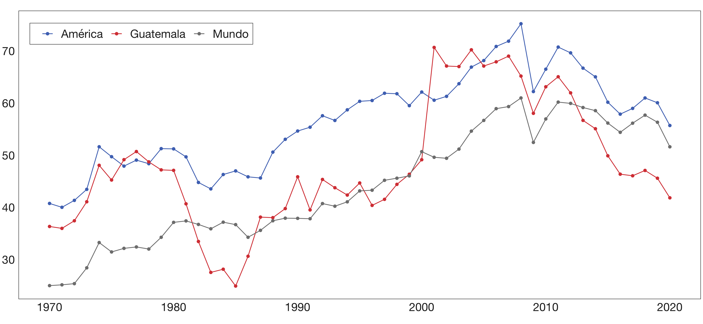

# Los patrones comerciales de Guatemala
Repositorio para mi tesis de grado: Relación entre el volumen de los flujos de comercio bilateral de Guatemala y la diferencia en la dotación relativa de factores productivos con sus socios de comercio exterior en América durante el período de 1995 a 2020

La presente investigación emplea una ecuación gravitacional ajustada a un panel de datos (que comprende a los flujos de exportaciones e importaciones desde 1995 hasta 2020 entre Guatemala y 30 economías radicadas en América) mediante el estimador de pseudo-máxima verosimilitud de Poisson, con el propósito de determinar la forma en la que los patrones comerciales del país pueden ser caracterizados según la teoría del comercio, examinar los determinantes del volumen de los flujos de intercambio comercial bilateral y evaluar el potencial de expansión de las actividades comerciales de Guatemala en materia de exportación de mercancías. Los resultados sugieren que el patrón comercial del país es explicado mayoritariamente por la teoría de las proporciones factoriales para ambos tipos de flujos de comercio, que los determinantes de las exportaciones difieren ligeramente al de los patrones que determinan al nivel esperado de los flujos de importaciones y que, para el 2020, Guatemala contaba con potencial para aumentar el volumen de sus exportaciones con 17 de los 30 socios comerciales incluidos en el análisis.

El recrudecimiento de la guerra civil guatemalteca a inicios de la década de los ochenta tuvo un impacto negativo en el volumen de los flujos de comercio internacional del país, reduciendo a la mitad el porcentaje de apertura comercial de Guatemala—al pasar de un punto máximo del 50% de apertura en 1977, a un 25% durante 1985, según cifras del Banco Mundial. Sin embargo, Guatemala comenzó de manera unilateral en los años noventa un proceso de inserción internacional, reforzado mediante un proceso de liberalización de carácter multilateral en el marco de la Organización Mundial del Comercio (OMC) y de la suscripción de tratados comerciales regionales y bilaterales. 

El resultado de este primer esfuerzo de inserción del país en los mercados internacionales fue exitoso en términos de apertura. Para el 2001, Guatemala habría registrado setenta puntos porcentuales en tal indicador. No obstante, esta tendencia se revierte a medida que el siglo avanza (para el 2020, la apertura comercial del país ha vuelto a niveles similares a los observados en 1970 y 1990).

Durante el 2012, el Consejo Nacional de Promoción de Exportaciones (CONAPEX) elaboró la Política Integrada de Comercio Exterior, Competitividad e Inversiones, un plan que sigue siendo utilizado en la actualidad por el Ministerio de Economía y, específicamente, por el Viceministerio de Integración y Comercio Exterior. Sus principales objetivos son diversificar la oferta exportable del país y ampliar el acceso de Guatemala en los mercados internacionales a través de la mejora de la competitividad de sus industrias. Sin embargo, la inserción del país en los mercados internacionales cuenta con una serie de desafíos que siguen sin ser completamente abordados. Entre ellos se encuentra la creciente sofisticación de la demanda a nivel mundial.

En atención a estos hechos, la presente investigación tiene como principal propósito analizar los flujos de exportaciones e importaciones entre Guatemala y el resto de naciones en América desde 1995 hasta el año 2020, en el contexto de un modelo gravitacional aumentado, con el objeto de determinar estadísticamente la forma en la que la diferencia en la dotación relativa de factores productivos entre dichas economías ha influido en la determinación del volumen de los flujos de comercio bilateral del país.

Las contribuciones del estudio abarcan tres áreas. En primer lugar, esta investigación demuestra que existe evidencia para considerar que los patrones comerciales de Guatemala con el resto de economías en América se desarrolla de un modo que es mayoritariamente consistente con la teoría de las proporciones factoriales, por lo que el patrón de los flujos comerciales del país puede ser caracterizado como inter-industrial (en contraposición a un patrón de comercio intra-industrial, basado en las nociones de la hipótesis de Linder).

Además, esta investigación repara en las diversas advertencias que han sido destacadas durante los últimos años respecto a la estimación de ecuaciones linealizadas mediante logaritmos y estimadas a través de mínimos cuadrados ordinarios. Por lo tanto, el modelo gravitacional es ajustado a los datos mediante el estimador de pseudo-máxima verosimilitud de Poisson (PPML), un modelo lineal generalizado que se ha convertido gradualmente en el estándar durante los procedimientos de estimación en la literatura empírica relacionada con la teoría gravitacional del comercio.

Por último, las predicciones del modelo de gravedad ajustado mediante el estimador de Poisson son empleadas para determinar si los canales comerciales en los flujos de exportaciones de Guatemala hacia el resto de las economías incluidas en el análisis ha sido infra- o sobreutilizado. Los resultados de este ejercicio permiten concluir que, durante el año 2020, Guatemala contaba con potencial para aumentar el volumen de sus exportaciones con 17 de los 30 socios comerciales incluidos en el análisis.

El documento se organiza de modo que la siguiente sección resume los hallazgos de tres estudios que emplean a la ecuación gravitacional, así como a las principales teorías que explican la manera en la que las actividades comerciales han operado a nivel internacional desde lo que convencionalmente es considerado como los inicios de la ciencia económica. En la sección 3 se plantea el problema de investigación y en la sección 4 se detallan tanto la especificación econométrica del modelo como el método de estimación empleado. La sección 5 expone los hallazgos encontrados durante el análisis exploratorio de datos y la estimación de la ecuación gravitacional. Por último, las secciones 6 y 7 discuten las conclusiones y recomendaciones de este estudio, respectivamente.
